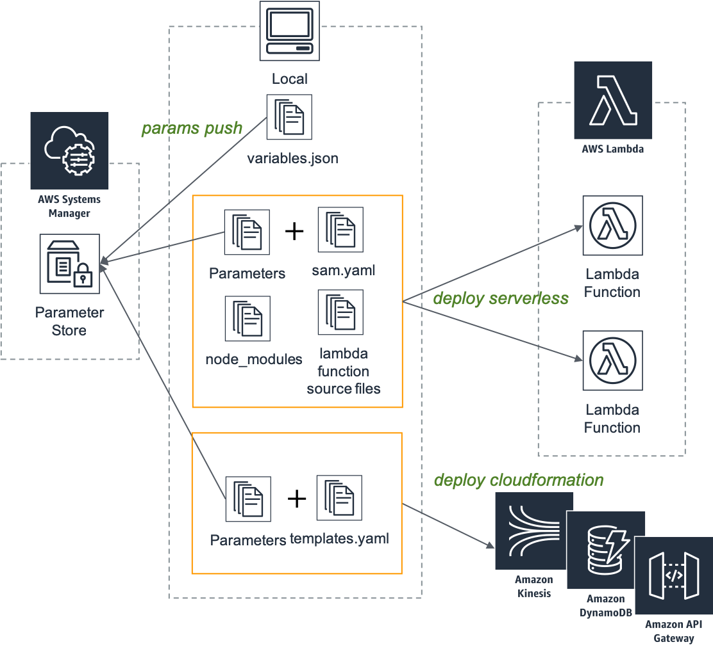

#### This is alpha. Do not use for your production.

TSAS - TypeScript Application for Serverless
===

A command line tool, supports AWS serverless application development.

* Create AWS serverless project template (TypeScript, node).
* Manage parameters by AWS Systems Manager parameter store.
* Deploy Lambda Function using AWS SAM.
* Deploy AWS resources using AWS CloudFormation.

Installation
---
 
```bash
npm i -g tsas
```

Usage
---

```bash
tsas -h
---
Usage: tsas COMMAND

Commands:
  tsas init     Create a new, empty Typed Lambda project from a template.
  tsas param    Manage application parameters, [push|list]
  tsas deploy   Deploy aws resources, [serverless|sls|cloudformation|cfn]
  tsas display  Display information [cfn-parameters]

Options:
  --version   Show version number                                      [boolean]
  --region    Use the indicated AWS region to override default in config file.
                                                                        [string]
  --env, -e   Environment name; such as dev, stg, prod...               [string]
  --verbose   Set verbose mode.                       [boolean] [default: false]
  -h, --help  Show help                                                [boolean]
```

### Requirements

AWS accessible CLI. See:

* [Configuring the AWS CLI \- AWS Command Line Interface](https://docs.aws.amazon.com/cli/latest/userguide/cli-chap-configure.html)

If you need to switch role, you can use these helpful tools.

* [tilfin/homebrew\-aws: AWS commands easy to manipulate on terminal](https://github.com/tilfin/homebrew-aws)
* [waddyu/aws\_swrole: Switch AWS IAM Roles and start new session\.](https://github.com/waddyu/aws_swrole)


### Create project using template.

```bash
mkdir hello-world
cd hello-world

tsas init
```

### Push parameters

`environments/${env}/parameters.json` has application parameters. This tool uses parameter store for CloudFormation deploy, so you should push local parameters to aws, at first. 

```bash
tsas param push --env stg
tsas param list --env stg
```

### Deploy lambda function (and function's IAM role )

```bash
tsas deploy serverless --env stg 
```

### Deploy resources using pure CloudFormation template

```bash
tsas deploy cloudformation dynamodb --env stg 
```

### Test invoke

Using [aws/aws\-cli: Universal Command Line Interface for Amazon Web Services](https://github.com/aws/aws-cli).

```bash
aws lambda invoke --function-name stg-hello-world-hello --log-type Tail \
--payload '{"key1":"value1", "key2":"value2", "key3":"value3"}' \
outputfile.txt
```

DynamoDB table `greeting` will have been updated.

How it works
---




* Manage parameters used in the whole application with a parameter store.
* Deploy Lambda Function using AWS SAM.
* Deploy AWS resources using CloudFormation.


**As you see, within this tool, you do not need to include the Parameters section in your SAM or CloudFormation templates.**

Develop your application
---

### Edit parameters

`environments/${env}/parameters.json` has application parameters. If you want to add/modify parameters, edit the json file and re-push to parameter store, using:

```bas
tsas param push --env stg
``` 

If you want to confirm CloudFormation Parameter section, use:

```bash
tsas display cfn-parameters --env stg
```

### Put / Override individual parameter, such as server-side access key, secret key.

If you don't want to write paramter to `variables.json`, use this command.

`tsas param put <key> <value>`

```bash
tsas param put AccessKey LFIOPWEPJSD23423ALGFJ --env stg
tsas param put AccessSecret afasdgbaj==awefaebasdvmkls--__ --env stg
```

### Add Lambda function 

There are 3 steps.

1. Add TypeScript source code.
2. Append entry to `webpack.config.js`.
3. Append the function information to `lambda.yaml`. 

### Source code

`src/handlers` has lambda function entry point. So, you can start developing new functions by adding files to handlers.

### webpack.config.js

After that, edit `webpack.config.js` to entry new function.

```js
...
module.exports = {
    mode: 'development',
    target: 'node',
    entry: {
       'hello-world': path.resolve(__dirname, './src/lambda/handlers/hello/hello-world.ts'),

        // add
        'next-step': path.resolve(__dirname, './src/lambda/handlers/next/next-step.ts'), 
    }
...    
```

### lambda.yaml

Finally, edit `templates/lambda.yaml`.

```yaml
Resources:
  HelloWorldHelloLambda:
    Type: AWS::Serverless::Function
    Properties:
      FunctionName: !Sub ${Env}-${AppName}-hello
      Role: !GetAtt HelloWorldLambdaRole.Arn
      Handler: hello-world/index.handler
      Runtime: nodejs8.10
      CodeUri:
        Bucket: !Ref DeployBucketName
        Key: !Sub ${ChangeSetHash}/dist.zip
      Timeout: 5
      Environment:
        Variables:
          ENV: !Ref Env
          GREETING_TABLE_NAME: !Ref GreetingTableName
          REGION: !Ref AWS::Region
            
  HelloWorldNextStepLambda: # Add
    Type: AWS::Serverless::Function
    Properties:
      FunctionName: !Sub ${Env}-${AppName}-next-step
      Role: !GetAtt HelloWorldLambdaRole.Arn
      Handler: next-step/index.handler
      Runtime: nodejs8.10
      CodeUri:
        Bucket: !Ref DeployBucketName
        Key: !Sub ${ChangeSetHash}/dist.zip
      Timeout: 5
      Environment:
        Variables:
          ENV: !Ref Env
          REGION: !Ref AWS::Region
```


Other AWS resources
---

1. Add CloudFormation template file or append to exists.
2. Deploy with a name.

`tsas deploy cloudformation <template_name>` needs target template name, such as:

```bash
tsas deploy cloudformation dynamodb --env stg
```

The <template_name> is required to match the CloudFormation template file name, so above command will deploy `templates/dynamodb.yaml`.
You can add new resources by following steps.

```bash
touch templates/s3.yaml
### edit file ###
tsas deploy cloudformation s3 --env stg
```


Other Environments
---

Initial templates only refers to the `stg` environment. You can define ather environments. 
Even in different environments, above flow is the same.
You only need to create a new environment setting file.

```bash
touch environments/prd/variables.json
### edit json file ###
```

After that, adjust `--env` option.

```bash
tsas param push --env prd
tsas deploy serverless --env prd 
tsas deploy cloudformation dynamodb --env prd
```
